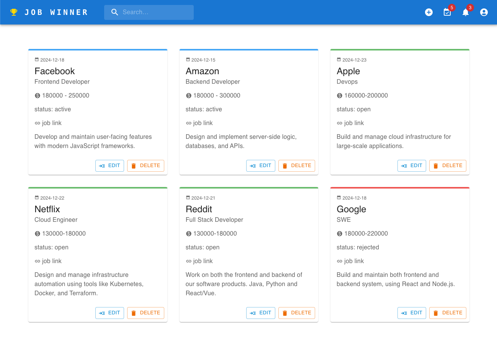
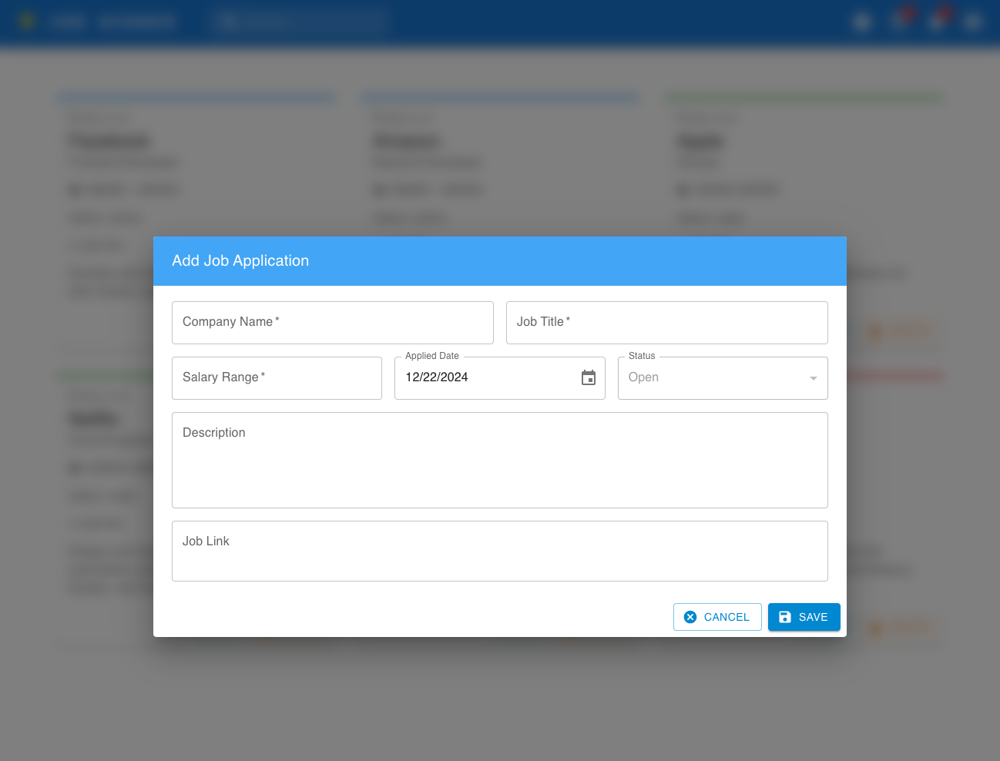

# Job Winner

## Live Demo

🚀 Check out the live demo! 👉 http://132.226.145.245/
✨ The data refreshes automatically every hour, so feel free to explore and test out any feature!

Let me know if you'd like any further tweaks by submitting an issue!

## Background

I lost my job right before the holiday season in 2022. I need to look for a new job and apply for as many as I can while all the big techs are laying off talents.

To keep track of job applications:

1. Use Google Spreadsheet (I am using it before this project). It is ugly, hard to maintain and easy to mess up the layout.
1. Use online tool like huntr.co. But it can only track 40 jobs and I don't want to spend a dime for the premium service.
1. Use pen and paper. It works but I can't copy and paste information such as the job url link and utilize it later.

None of the about is fun or totally fit my use case.

That's the reason for me to build something for myself, and potentially you, to get the job done (and to get a new job successfully!)

## Benefit of Job Winner

Job Winner helps you keep track of all your job applications in one place—totally free! No hidden fees, and you won't have to worry about your personal data being sold.

One of the handy features is the Profile Page. This is where you can store all the personal information that job applications often ask for (like your LinkedIn URL). Plus, it has a super handy feature that lets you copy any field to your clipboard with just a click.

## Features

Key Functions:
1. __Index Page:__

    View a list of all your job applications in one place, with easy access to each application’s details and status.
    
1. __Create New Job Application:__

    Easily add new job applications to your list with a user-friendly form.
    
1. __Delete Job Application:__

    Remove any applications you no longer need with a simple delete option.
1. __Edit Job Application:__

    Make updates to your existing job applications as the status of your applications change or new information becomes available.
    
    - __Manage Interview:__

      Keep track of your interviews with the ability to add and manage interview details.
      
    - __Manage Offer:__

      Track any job offers you’ve received, including details about the salary and offer date.
      
1. __Profile Page:__
    
    Store and manage all your personal information in one spot
    
1. __Interview List:__
  
    Keep track of all your interviews in one place, with easy-to-view details and statuses plus sortable headers.
    
1. __Offer List:__
    
    Track all job offers you’ve received with sortable headers.
    

1. __Search and Filter:__
    
    Quickly search for specific job applications based on keywords to help you stay organized. Whether it's the company name, job title, or description, finding the right job application is easy.
1. __Interview and Offer Count:__
    
    Stay on top of your job search with an overview of how many interviews and offers you currently have, making it easier to manage multiple opportunities.

## Components

Job Winner has two components
1. UI (this repo)
1. [Backend](https://github.com/januschung/job-winner)

## About this repo

This is the UI for Job Winner and here is the stack:

1. React
1. Apollo Client
1. Material UI

## To build 

Please follow the build instruction from the [UI repo](https://github.com/januschung/job-winner) to bring up the backend.

```console
npm start
```
or use docker
```console
docker build -t job-winner-ui .
docker run -p 3000:3000 -d job-winner-ui
```

## Contributing

We welcome contributions! If you'd like to help improve Job Winner, here's how you can contribute:

1. Fork the repository.
1. Create a new branch for your feature or fix.
1. Make your changes and ensure the tests are passing.
1. Submit a pull request with a description of the changes you've made.

Feel free to open an issue if you have any questions or suggestions!
